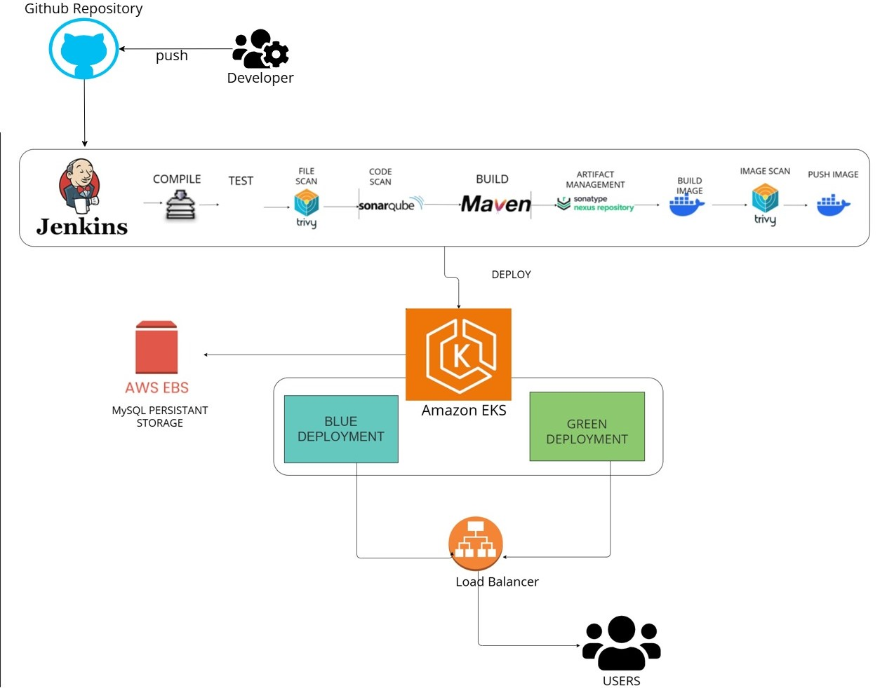

# 🚀 Blue-Green Deployment on AWS EKS with Jenkins

This project sets up a CI/CD pipeline using Jenkins to deploy a Spring Boot and MySQL app on Amazon EKS using the Blue-Green deployment strategy.

---

- Build and test the app with Maven
- Scan code with SonarQube and image with Trivy
- Push artifacts to Nexus and Docker images to Docker Hub
- Deploy the app to Kubernetes (EKS) with Blue-Green environments
- Use Jenkins parameters to choose environment and switch traffic
- Use AWS EBS for MySQL persistent storage

---

## 🧰 Tools & Technologies

- Docker
- Kubernetes (Amazon EKS)
- Jenkins (CI/CD)
- SonarQube (Code scan)
- Trivy (Security scan)
- Nexus (Artifact storage)
- AWS EBS (Persistent volumes)

---

## 🚦 How Blue-Green Works

1. Jenkins builds, tests, scans, and pushes the app
2. Deploys either to Blue or Green environment on EKS
3. You can switch traffic between versions using a Jenkins parameter
4. This ensures zero downtime and easy rollback

